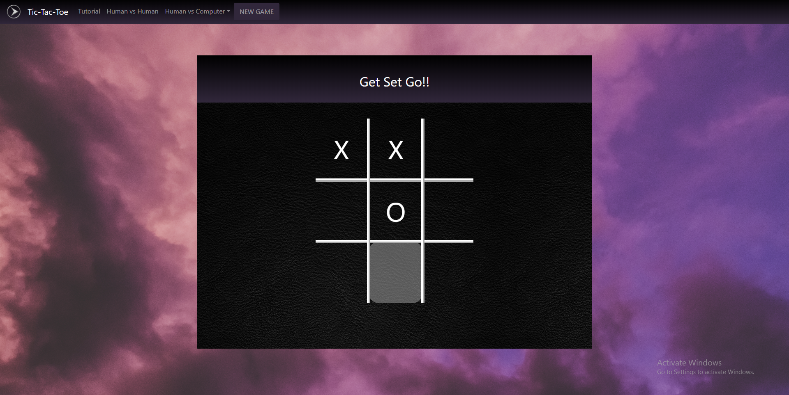
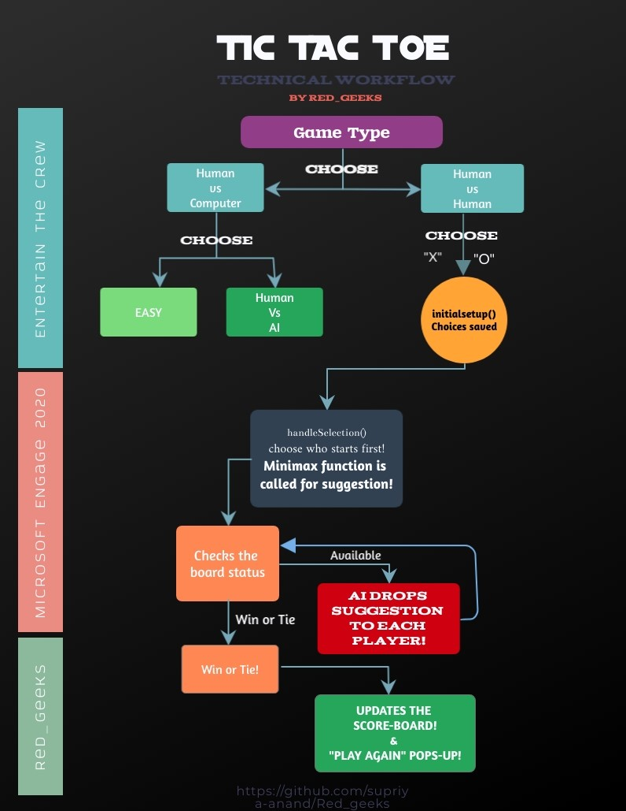
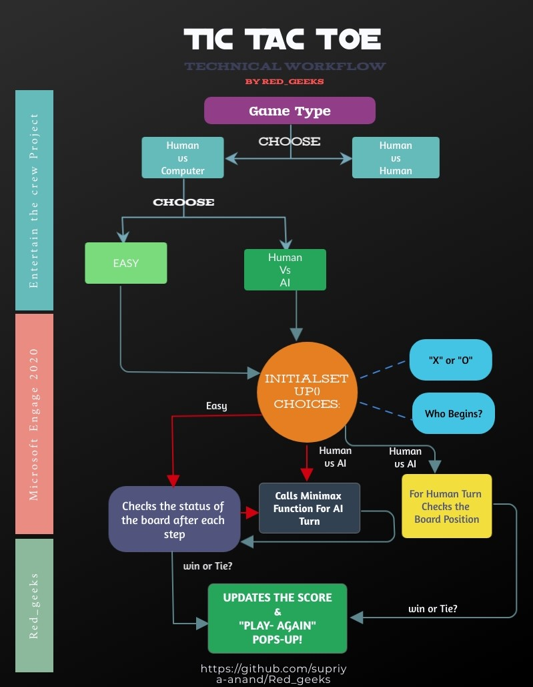

# Red_geeks
Microsoft Engage 2020
<h1 id="top" align="center">  TIC-TAC-TOE</h1>
<h3 align="center">Welcome to the world of AI ! 
Presenting to you the Tic-Tac-Toe Game with the Unbeatable AI. </h3>
<h2 align="center">BEAT THE AI IF YOU CAN!</h2>

<a href="https://supriya-anand.github.io/Red_geeks/">Tic-Tac-Toe</a>

---

## Project Description 

This is the "Entertain the Crew" project under the program **Microsoft Engage 2020** by the team "Red_geeks". In this project we have created Tic-Tac-Toe with Unbeatable AI. Also, we have achieved the following Technical Advancements.

 

## Technical Achievements
* Implementation of both **Human vs AI** and **Human vs Human** game types.
* In the Human vs Human game type the AI offers **Suggestions to each player** for the upcoming steps.

* For the Human Vs Computer game type a user can choose between two **Difficulty Levels** i.e. Easy and Difficult. Opting for the "Difficult level" begins the battle of **Human vs AI**.
* **Score-board** is reflected for each player at the end of each game! 
    * Won! - 10 points
    * Tie! - 5 points each
    * Lost! - 0 points   
* In order to guide the beginners a **Tutorial** is added with the game. Go through it if you need any help.
## Technologies Used
We would like to mention that being a part of this program helped us to not only learn these languages and frameworks, but also have a hands-on experience with them.
* HTML5
* CSS
* JavaScript
* Bootstrap
    ### Algoritm Used:
         Minimax Algorithm

## Architecture Design: 
Here is the Work flow chart of the various features used in the project.

* **Human vs Human Description** : 
 

* **Human vs Computer Description** : 
 

[BACK TO TOP ↑](#top)
